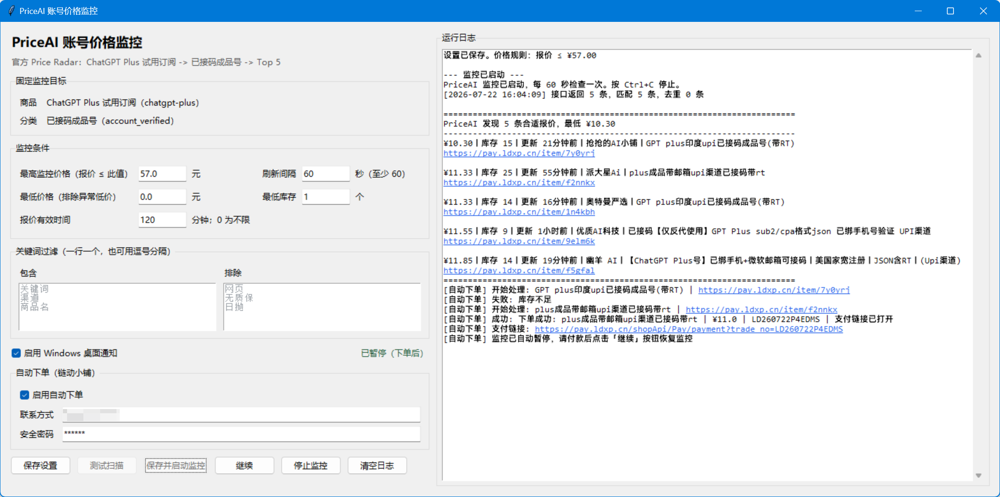

# PriceAI 账号价格监控

通过 [PriceAI](https://priceai.cc) Price Radar V1 官方公开快照，定时检查 ChatGPT Plus「已接码成品号」Top 5 报价。匹配到合适报价时桌面通知提醒，并支持对链动小铺 (ldxp.cn) 商品**自动下单**。



## 功能概览

- 定时轮询 Price Radar 快照，本地筛选价格、库存、关键词等条件
- 与上次扫描对比去重：新报价、降价、库存增加时才提醒
- Windows Toast 桌面通知 + Webhook + Telegram 多渠道提醒
- 自动下单：匹配到链动小铺报价后，通过 API 秒级下单并打开支付页
- 下单后自动暂停监控，付款后手动点击「继续」恢复
- GUI 左右分栏：左侧设置、右侧实时日志，日志中链接可点击

## 快速开始

### 环境要求

- Python 3.10+
- Windows（Toast 通知依赖 Windows WinRT API）

### 安装与运行

1. 克隆仓库

```bash
git clone https://github.com/your-username/priceai-monitor.git
cd priceai-monitor
```

2. 复制配置模板

```bash
copy config.example.json config.json
```

3. 双击 `start_monitor.bat` 启动设置窗口

或通过命令行启动：

```powershell
python settings_gui.py
```

### 命令行用法

测试扫描（不提醒、不写状态）：

```powershell
python price_monitor.py --config config.json check --dry-run
```

单次检查并提醒：

```powershell
python price_monitor.py --config config.json check
```

持续监控：

```powershell
python price_monitor.py --config config.json watch
```

## 设置窗口

双击 `start_monitor.bat` 打开 GUI 界面。左侧为设置区，右侧为实时运行日志。

**监控条件：**

- 最高监控价格 -- 报价 ≤ 此值时才匹配
- 最低价格 -- 过滤异常低价，设为 0 不启用
- 最低库存 -- 报价库存必须 ≥ 此值
- 报价有效时间 -- 只接受最近 N 分钟内更新的报价
- 刷新间隔 -- 最短 60 秒，建议 120~300 秒

**关键词过滤：**

- 包含关键词 -- 标题必须同时包含所有关键词才匹配
- 排除关键词 -- 包含任意一个就排除

**操作按钮：**

- 保存设置 / 测试扫描 / 保存并启动监控
- 暂停/继续 -- 手动暂停监控，或自动下单后自动暂停
- 停止监控 / 清空日志

关闭设置窗口会同时停止由该窗口启动的监控。

## 去重机制

每次点击「保存并启动监控」视为全新会话，清空上次的去重状态。后续扫描与上次结果对比，以下情况才提醒：

1. **新报价** -- 上次没有的商品
2. **降价** -- 相同商品但价格降低
3. **库存增加** -- 相同商品但库存数量上升

## 自动下单

启用后，匹配到链动小铺 (ldxp.cn) 报价时自动完成下单：

1. 查询商品详情，获取支付渠道
2. 提交订单，自动填入联系方式和安全密码
3. 打开商品详情页 + 支付页
4. **自动暂停监控**，等待手动付款后点击「继续」

在设置窗口的「自动下单」区配置：启用开关、联系方式、安全密码。默认使用支付宝渠道。
